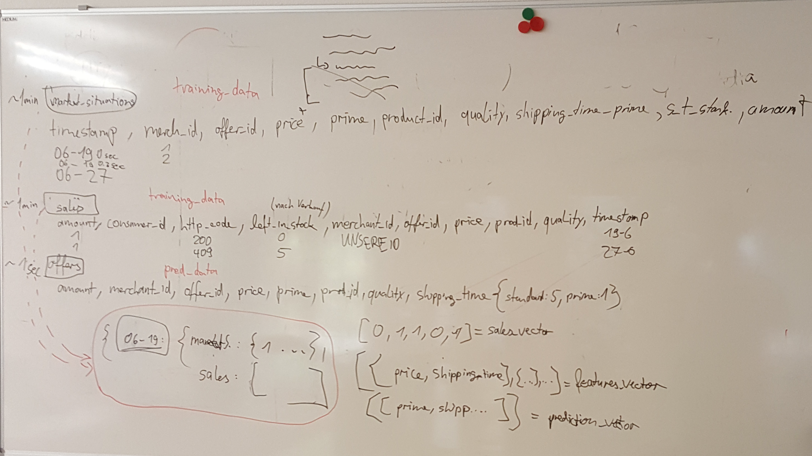

# dynamicpricing


### Run tests

* `cd merchant`
* `python -m unittest` bzw. `python3 -m unittest`

### Platform on VM

Dashboard: <http://vm-dynpricing-team-8.eaalab.hpi.uni-potsdam.de>

* `ssh Marcel.Jankrift@vm-dynpricing-team-8.eaalab.hpi.uni-potsdam.de`
* `sudo -i`
* The github files are stored in `/home/dynamicpricing/masterproject-pricewars`
* The docker-compose command is running in a `screen` session
* Execute `screen -r` to reattach the session
* Press `Ctrl` + `a` + `d` to detach

```
export PRICEWARS_MARKETPLACE_URL="http://vm-dynpricing-team-8.eaalab.hpi.uni-potsdam.de:8080"
export PRICEWARS_PRODUCER_URL="http://vm-dynpricing-team-8.eaalab.hpi.uni-potsdam.de:3050"
export PRICEWARS_KAFKA_REVERSE_PROXY_URL="http://vm-dynpricing-team-8.eaalab.hpi.uni-potsdam.de:8001"
export API_TOKEN="Vdgdjn1jNxW3KLEsd9hkQcY0EhlBUAd0nLdX9eIWcoYwAmqnuYYMB7MOo9aJJEJ7"
```


